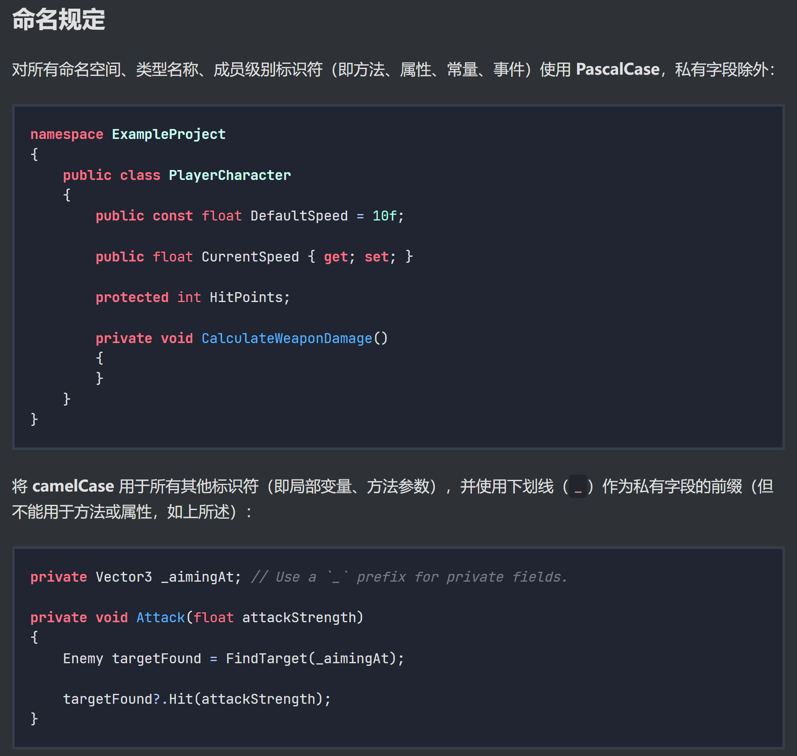

# Graduation Project

#### 介绍
25期毕设

#### 软件架构
Unity2022.3.53f1c1

#### C# 风格指南
https://docs.godotengine.org/zh-cn/4.x/tutorials/scripting/c_sharp/c_sharp_style_guide.html#naming-conventions 
取用以下命名原则 
